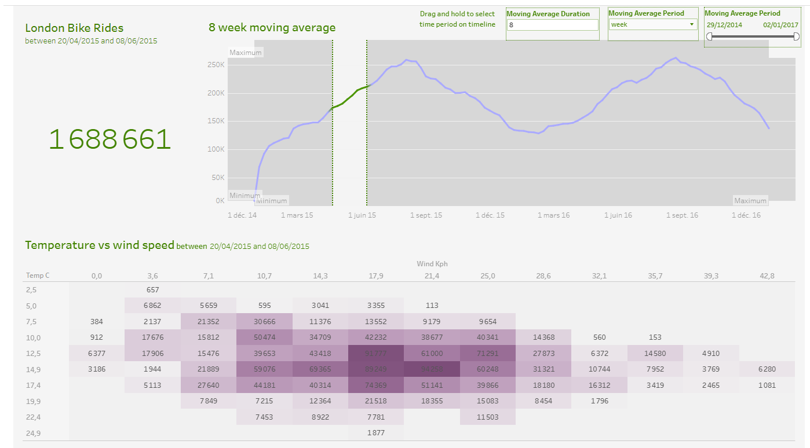

----
London Bikes use Analysis
----

# Acknowledgement

First, let me give the credit to **Mo Chen** who created and explained this project from his youtube count: https://www.youtube.com/watch?v=nl9eZl1IOKI.

# 1. Using Python to clean the data

We have used Python to clean the donwloaded dataset.

# 2. Data Visualization using Tableau

We will create 5 visualizations:
- Total number of Bike Rides
- Moving average chart
- Temperature versus Wind speed heatmap
- Total number of Bike Rides split by weather and by the hour when hovering over the moving average chart
and when hovering over the heatmap.

The moving average chart will be our main visual. Therefore, we will able to use Tableau's Set actions feature
to control and filter the entire Dashboard.

We are also going to have user defined parameters at the top of the Dashboard to control the moving average,
so, for example, we can specify a 30 days moving average or to a weak granularity (instead of a day).

We will also have a filter where we can filter the timeline, so we can shorten it or we can lengthen it depending on our preference.

Here below is a screenshot of the final Dashboard built in Tableau software and published in [Tableau Public](https://public.tableau.com/app/profile/boubacar.billo.bah/viz/LondonBikeRides_17093096747740/Tableaudebord1?publish=yes).

